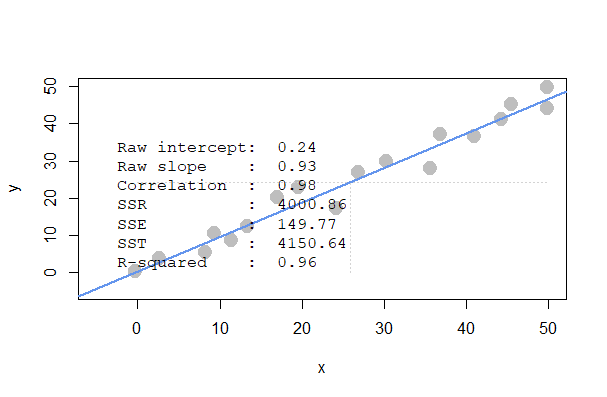
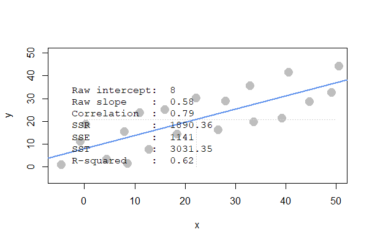
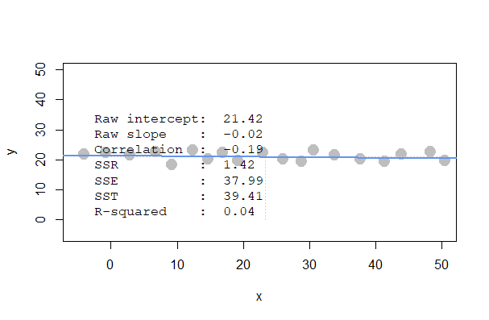
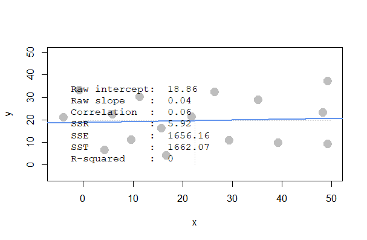
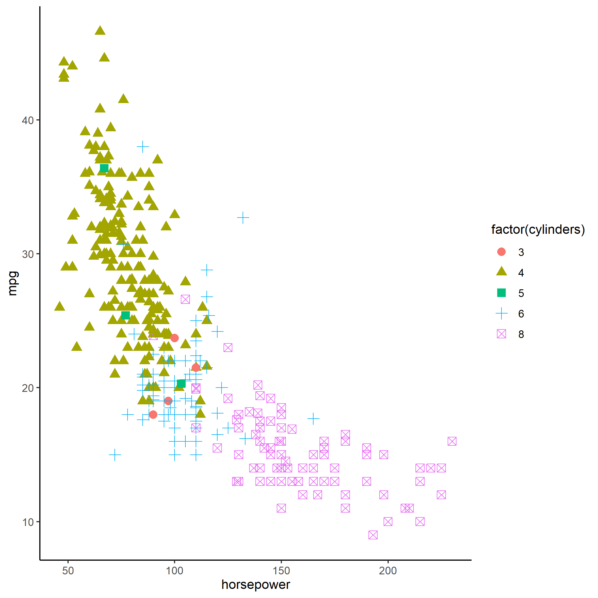
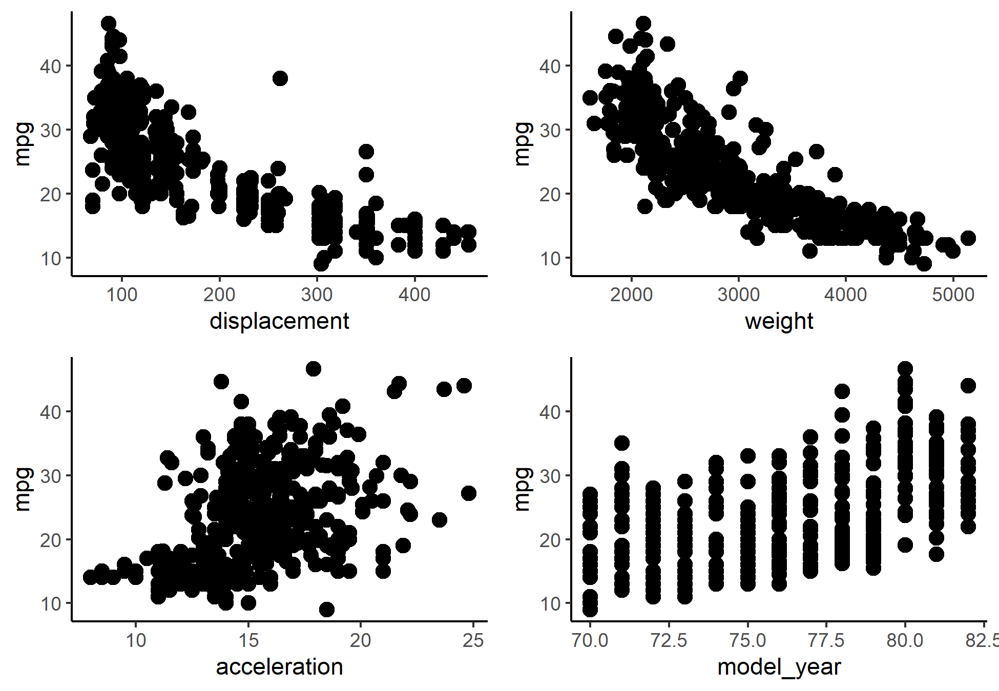
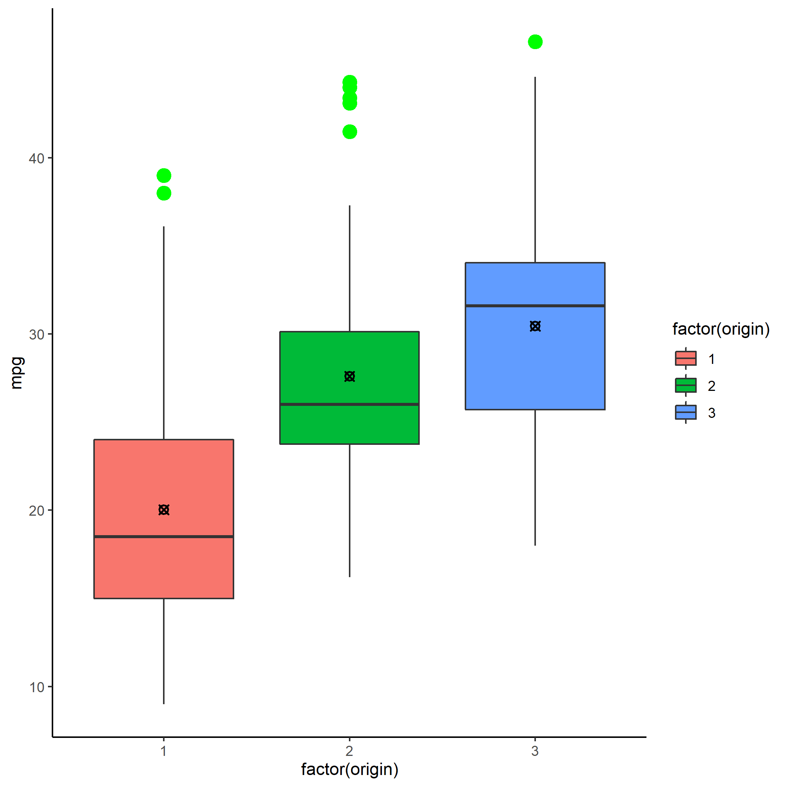
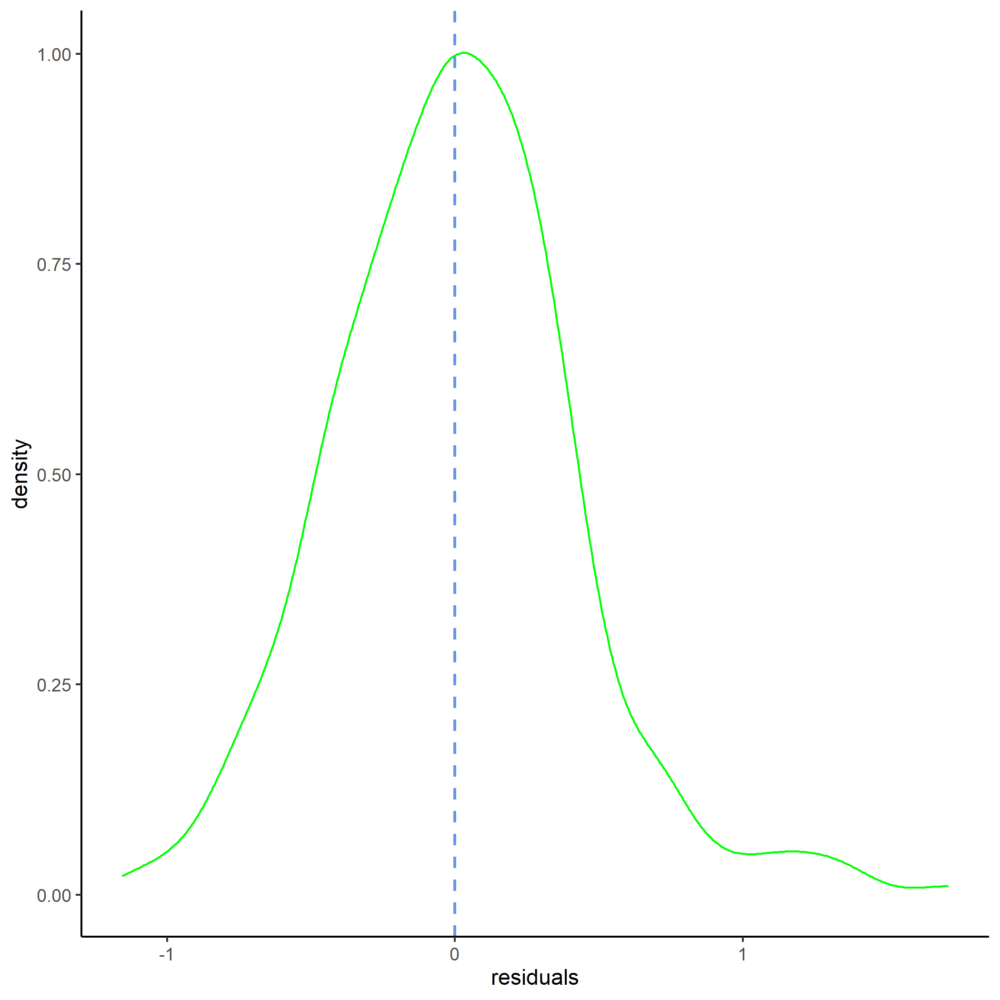

```{r setup, include=FALSE}
knitr::opts_chunk$set(echo = TRUE)
require(dplyr)
library(ggplot2)
require(gridExtra)
require(broom)
```

# Question 1

## a) Scenario 1 vs Scenario 2: which has the stronger R squared?

We expect Scenario 1 to have the stronger value of R squared. That is because the total variability in Scenario 2 is larger than the regression variability, while the total variability in Scenario 1 is similar to the regression variability.

```{r plot_1, echo=FALSE, fig.cap="Scenario 1", out.width = '70%', out.height = '70%', fig.align='center'}

```
```{r plot_2, echo=FALSE, fig.cap="Scenario 2", out.width = '70%', out.height = '70%', fig.align='center'}

```

\newpage

## b) Scenario 3 vs Scenario 4: which has the stronger R squared?

Perhaps, none of these scenarios will show a decent value of R squared. That is because in both scenarios the x-values don't account for any variation in the y-values.

```{r plot_3, echo=FALSE, fig.cap="Scenario 3", out.width = '70%', out.height = '70%', fig.align='center'}

```

```{r plot_4, echo=FALSE, fig.cap="Scenario 4",out.width = '70%', out.height = '70%', fig.align='center', }

```

\newpage

## c) Scenario 1 vs Scenario 2: which has bigger/smaller SSE, SSR, and SST?

We expect Scenario 2 to have a higher SSE, SSR and SST. However, the results on the plot show that SSR and SST are actually greater in Scenario 1.

## d) Scenario 3 vs Scenario 4: which has bigger/smaller SSE, SSR, and SST?

We expect Scenario 4 to have a higher SSE, SSR and SST, and that's what happens in our simulations indeed.

# Question 2

Let's load the dataset first:
```{r}
prog <- read.csv("../../data/programmer_salaries.txt", sep="\t")
```

## a) Estimating the model Salary ~ Experience + Score + Degree

First, we estimate the model:
```{r}
mod <- lm(Salary ~ Experience + Score + Degree, data = prog)
summary(mod)
```

We can see that the beta coefficients are those represented under the "Estimate" column, while R squared is 0.8468. Now, let's see the first 5 fitted values:
```{r}
mod$fitted.values[1:5]
```

And the first 5 values of the residuals:
```{r}
mod$residuals[1:5]
```

## b) Estimating the regression with linear algebra

### i) Creating the X matrix

First, we create a vector of ones, which will capture the intercept:
```{r}
Intercept <- rep(1, 20)
```

Then, we create a matrix that includes the 1 values in the first column, and the independent variables from our dataset in the remaining three columns:
```{r}
xplan <- prog[-4]
X <- as.matrix(cbind(Intercept, xplan))
```

### ii) Creating the y vector

```{r}
y <- as.vector(prog[,4])
```
### iii) Computing beta_hat

```{r, warning=FALSE}
beta_hat <- solve(t(X) %*% X) %*% t(X) %*% y

# Displaying the beta coefficients on a table:
knitr::kable(beta_hat, caption = "Summary of Beta coefficients")
```
We can notice that the coefficients are the same as those estimated with the lm() function.

### iv) Computing y_hat and res and showing their first 5 values

At first, we compute y_hat:
```{r}
y_hat <- X %*% beta_hat
y_hat[1:5]
```

Next, we compute the vector of residuals:
```{r}
res <- y - y_hat
res[1:5]
```

Once again, the values are the same as those originating from lm(). 

### v) Computing SSR, SSE and SST

Let's start by computing SSR and SSE:
```{r}
SSR <- round(sum((y_hat - mean(y))^2), 4)
SSE <- round(sum((y - y_hat)^2), 4)
```

The SST can be calculated in the following way:
```{r}
SST <- SSR + SSE
```
Here's the summary of the sum of squares:
```{r, warning = FALSE}
ss <- rbind(SSR, SSE, SST)
knitr::kable(ss, caption = "Summary of the Sum of Squares")
```

## c) Computing the R squared in two ways

### i) Computing R squared by using SSR and SST

```{r}
round(SSR/SST, 4)
```

### ii) Computing R squared by using the squared correlation of y and y_hat

```{r}
round(cor(y, y_hat)^2, 4)
```

As we can see, the values of R squared computed with the two different methods are the same. In addition to that, they are also equal to the R squared computed with lm() in a), which is a proof of the correctness of calculations.

# Question 3

Let's load the dataset and add the variable names:
```{r, tidy=TRUE, tidy.opts = list(blank = FALSE, width.cutoff = 60), warning = FALSE}
auto <- read.table("../../data/auto-data.txt", header=FALSE, na.strings = "?", colClasses = list(numeric = 1:8, character = 9))
names(auto) <- c("mpg", "cylinders", "displacement", "horsepower", "weight",
"acceleration", "model_year", "origin", "car_name") 

auto <- na.omit(auto)
```

## a) Exploring the data

### i) Visualizing the data in a relevant way

First, we could plot a scatterplot that will make us understand the potential relationship between number of cylinders and fuel consumption. We expect bigger engines (with more cylinders, which we believe are also more powerful on average) to consume more fuel:
```{r, warning= FALSE, tidy=TRUE, tidy.opts = list(blank = FALSE, width.cutoff = 60)}
plot_5 <- ggplot(auto, aes(x=horsepower, y=mpg, color=factor(cylinders), shape=factor(cylinders))) +
    geom_point(size=3) +
    theme_classic()

# ggsave("plot_5.png", plot_5)
```

```{r plot_5, echo=FALSE, fig.cap="Relation between number of cylinders, horsepower and mpg", out.width = '70%', out.height = '70%', fig.align='center'}

```

Indeed, the plot shows a tendency. As the number of cylinders increases, the amount of horsepower increases too. But this influences the mileage per gallon negatively. On the other hand, we see that most of the eco-friendly engines are those with only 4 cylinders.

Now, let's see what is the relationship between mpg and displacement, weight, acceleration and year of release. We expect a higher displacement and higher weight to cause a higher fuel consumption, a slower acceleration to cause a lower fuel consumption, and finally a more recent year of release to decrease the fuel consumption.
```{r}
p1<- ggplot(auto, aes(x=displacement, y=mpg)) +
    geom_point(size=3) +
    theme_classic()

p2 <- ggplot(auto, aes(x=weight, y=mpg)) +
    geom_point(size=3) +
    theme_classic()

p3 <- ggplot(auto, aes(x=acceleration, y=mpg)) +
    geom_point(size=3) +
    theme_classic()

p4 <- ggplot(auto, aes(x=model_year, y=mpg)) +
    geom_point(size=3) +
    theme_classic()

ordered <- arrangeGrob(p1, p2, p3, p4, ncol = 2)
# ggsave("plot_6.png", ordered)
```
```{r plot_6, echo=FALSE, fig.cap="Effects of displacement, weight, acceleration and year of release on mpg", out.width = '70%', out.height = '70%', fig.align='center'}

```

As we can see from the plots above, our expectations are met. Especially in terms of weight, displacement and year of release, we can see the relationship quite clearly, while it is a little harder to see it in terms of acceleration.

In the end, let's also verify the link between mpg and origin:
```{r, warning=FALSE, tidy=TRUE, tidy.opts = list(blank = FALSE, width.cutoff = 60)}
plot_7 <- ggplot(auto, aes(factor(origin), mpg)) +
  geom_boxplot(aes(fill = factor(origin)), outlier.color = "green", outlier.size = 4) +
  stat_summary(fun.y="mean", shape = 13 ) +
  theme_classic()

# ggsave("plot_7.png", plot_7)
```

```{r plot_7, echo=FALSE, fig.cap="Relation between mpg and origin", out.width = '60%', out.height = '60%', fig.align='center'}

```

\newpage

We can see that cars produced in Japan (3) tend to have a higher mileage per gallon.

### ii) Reporting a correlation table of all variables

```{r}
cors <- round(cor(auto[-9], use="pairwise.complete.obs"), 2)
knitr::kable(cors, caption = "Table of correlations")
```

### iii) From the visualizations and correlations, which variables seem to relate to mpg?

It looks like most of the variables are related to mpg, at least moderately. The variables cylinders, displacement, horsepower and weight are highly negatively correlated with mpg. The variables acceleration, model_year and origin are moderately positively correlated with mpg.

### iv) Which relationships might not be linear?

From the plots we have created so far, it seems that mpg does not have a linear relationship with:

* displacement,
* horsepower,
* weight.

### v) Are there any pairs of independent variables that are highly correlated?

From the correlation table, we see that the following pairs have a high positive correlation (r > 0.7):

* cylinders and displacement,
* cylinders and horsepower,
* cylinders and weight,
* displacement and horsepower,
* displacement and weight,
* horsepower and weight.

While we see that the following pairs have a high negative correlation (r < 0.7):

* mpg and cylinders,
* mpg and displacement,
* mpg and horsepower,
* mpg and weight.

The relationship between acceleration and horsepower is also quite strong and negative, with a coefficient of -0.69.

## b) Creating a linear regression model with mpg as the dependent variable

```{r, tidy=TRUE, tidy.opts = list(blank = FALSE, width.cutoff = 60)}
auto_regr <- lm(mpg ~ cylinders + displacement + horsepower + weight + acceleration + model_year + factor(origin), data = auto)
summary(auto_regr)
```
### i) Which independent variables have a significant relationship with mpg at 1% significance?

As we can see, there are a few variables that have a significant relationship with mpg within 1%. They are: 

* displacement, 
* weight, 
* model_year, 
* The two dummies mapping for origin.

### ii) Is it possible to determine which independent variables are the most effective at increasing mpg?

I think that it is hard to determine this as the independent variables all have different units. Therefore, we cannot compare their estimates easily, it might be a good idea to standardize them.

## c) Resolving some issues about our regression model

### i) Creating fully standardized regression results

```{r, tidy=TRUE, tidy.opts = list(blank = FALSE, width.cutoff = 60)}
auto_std <- data.frame(scale(auto[-9]), auto[-9])
auto_regr_std <- (lm(mpg ~ cylinders + displacement + horsepower + weight + acceleration + model_year + factor(origin), data = auto_std))
summary(auto_regr_std)
```

Now the beta coefficients seem much more intuitive to compare, as they are on the same scale. We can see that displacement, model_year and origin have significantly positive slopes, while weight has a significantly negative slope.

### ii) Regressing mpg over each nonsignificant independent variable individually

The nonsignificant variables from the above model are cylinders, horsepower and acceleration.
Let's start by running the regression with cylinders as independent variable:
```{r}
cyl <- lm(mpg ~ cylinders, data = auto_std)
summary(cyl)
```

As we can see, the variable becomes statistically significant. Let's see how about horsepower:
```{r}
horsey <- lm(mpg ~ horsepower, data = auto_std)
summary(horsey)
```

In this case as well, the independent variable becomes statistically significant. Finally, let's check acceleration:
```{r}
accel <- lm(mpg ~ acceleration, data = auto_std)
summary(accel)
```

This variable becomes significant as well. All the three variables that previously were not statistically significant become significant if we use them as independent variables alone in the regression model.

### iii) Plotting the density of the residuals

Let's plot the residuals of our fully standardized regression:

\newpage

```{r, tidy=TRUE, tidy.opts = list(blank = FALSE, width.cutoff = 60)}
modf <- fortify(auto_regr_std)

plot_8 <- ggplot(modf, aes(x = .resid)) +
  geom_density(col = "green") +
  geom_vline(xintercept = mean(modf$.resid), lty = "dashed", col = "cornflowerblue", size = 0.75) +
  labs(x = "residuals") +
  theme_classic()

# ggsave("plot_8.png", plot_8)
```

```{r plot_8, echo=FALSE, fig.cap="Residuals of the fully standardized regression", out.width = '60%', out.height = '60%', fig.align='center'}

```

As we can see from the plot above, the residuals seem to be approximately normally distributed and centered around 0.

