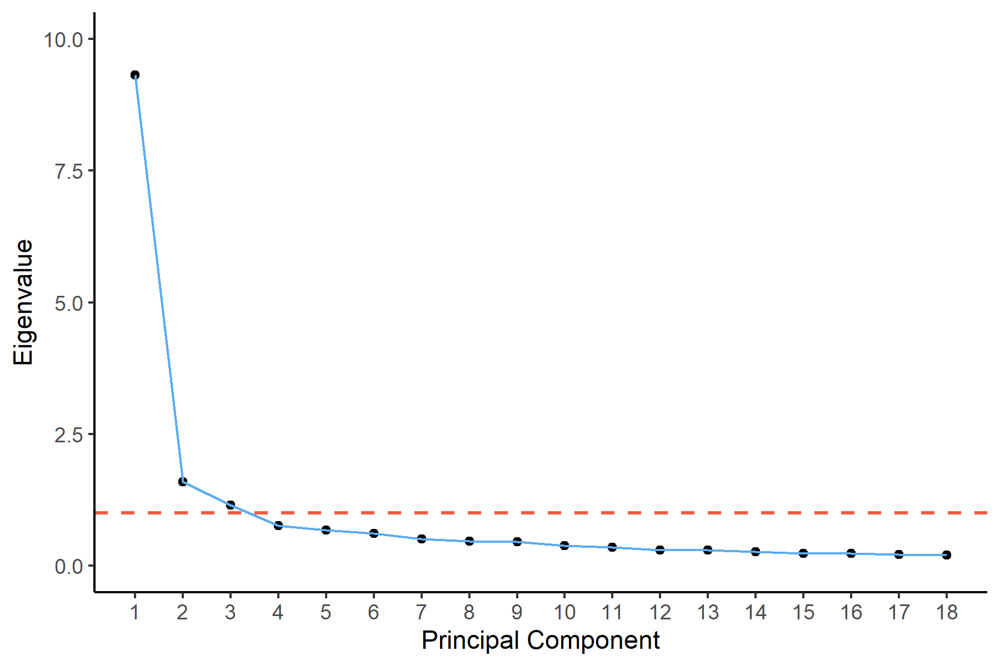
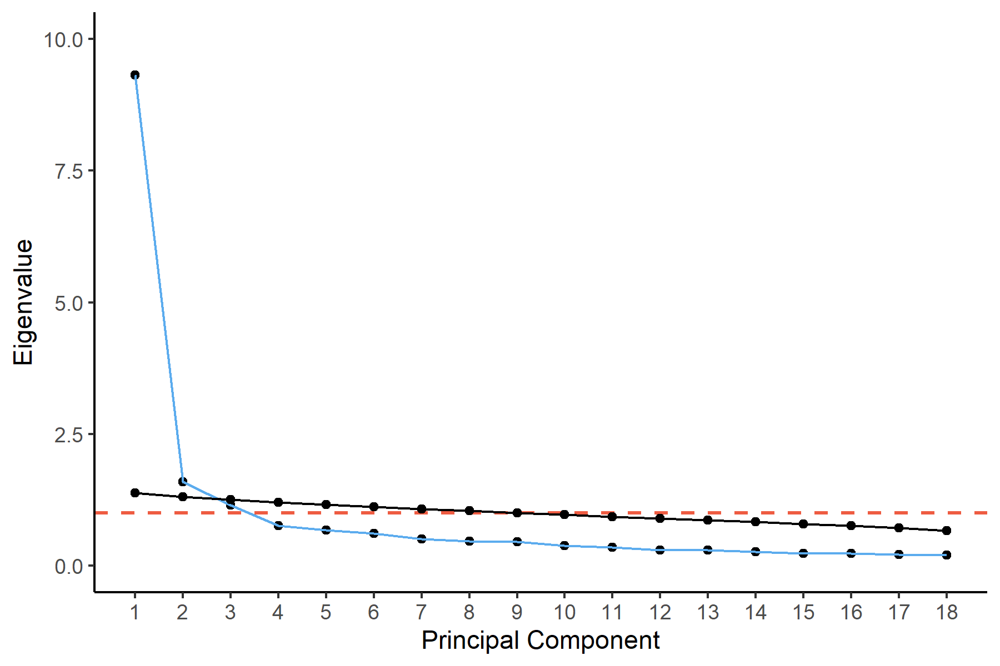

```{r setup, include=FALSE}
knitr::opts_chunk$set(echo = TRUE)
require(readxl)
require(ggplot2)
require(psych)
```

Importing the data:

```{r}
questions <- read_excel("../../data/security_questions.xlsx", sheet = 1)
data <- read_excel("../../data/security_questions.xlsx", sheet = 2)
```

# Question 1

## a) Conducting Horn's Parallel Analysis

First of all, we need to run principal component analysis on our data; we can also see the eigenvalues on a screeplot:

```{r}
sec_pca <- prcomp(data, scale. = TRUE)

sec_eigen <- sec_pca$sdev^2 # Computing the eigenvalues as the power-2 of stdeviations

plt_1 <- qplot(c(1:18), sec_eigen) + 
  geom_line(color = "steelblue2") + 
  xlab("Principal Component") + 
  ylab("Eigenvalue") +
  geom_hline(yintercept = 1, color = "tomato2", linetype = "dashed", size = 0.75) +
  scale_x_continuous(breaks = seq(1, 18, by = 1)) +
  ylim(0, 10) +
  theme_classic()

ggsave(filename = "plot_1.png", width = 6, height = 4, plt_1)
```
\newpage

```{r plot_1, echo=FALSE, fig.cap="Screeplot for security questionnaire data", out.width = '60%', out.height = '40%', fig.align='center'}

```

Then, we can create a function to run a PCA on a given dataset of random values:

```{r}
sim_noise_ev <- function(n, p) {
  noise <- data.frame(replicate(p, rnorm(n)))
  eigen(cor(noise))$values
}
```

Next, we repeat the process k times, say a 150 times:

```{r}
evalues_noise <- replicate(150, sim_noise_ev(nrow(data), ncol(data)))
```

And then we shall average each of the noise eigenvalues over k:

```{r}
evalues_mean <- apply(evalues_noise, 1, mean)
```

Let's plot the scree plots of the eigenvalues from the security dataset vs the randomly generated noise:

```{r}
plt_2 <- plt_1 +
  geom_point(y = evalues_mean) + geom_line(y = evalues_mean)

ggsave(filename = "plot_2.png", width = 6, height = 4, plt_2)
```

```{r plot_2, echo=FALSE, fig.cap="Screeplot for security questionnaire data vs randomly generated noise", out.width = '60%', out.height = '40%', fig.align='center'}

```
\newpage

## b) How many dimensions would you retain after conducting Parallel Analysis?

I would retain only the first 2 dimensions, even though the second one has eigenvalues just barely greater than the noise.

# Question 2

Let's consider the dimensions as factors instead of composites, and verify factor loadings:

```{r}
sec_principal <- principal(data, nfactors = 3, rotate = "none", scores = TRUE)
```

## a) Looking at the loadings of the first 3 principal components, to which components does each item seem to best belong?

Let's see the loadings:

```{r}
PC_loadings <- round(sec_principal$loadings[, 1:3], 2)
knitr::kable(PC_loadings, caption = "Loadings of the first 3 principal components")
```

It looks like PC1 is explaining a little of variance for every item, so it is quite hard to interpret.
PC2 instead explains quite well Q4, Q12 and Q17.
On the other hand, PC3 explains Q5 and Q10 decently.

If we are just looking at the items alone, each of them finds its greater loading within PC1, apart from Q4 and Q17 (PC2).

## b) How much of the total variance of the security dataset do the first 3 PCs capture?

```{r}
round(sum(sec_principal$Vaccounted[2, ]), 4)
```

As we can see above, roughly 67% of the total variance is explained by the first 3 PCs.

## c) Looking at commonality and uniqueness, which items are less than adequately explained by the first 3 principal components?

```{r}
knitr::kable(round(data.frame(sec_principal$communality, sec_principal$uniquenesses), 2),
             caption = "Communality and uniqueness")
```

It looks like those items which are explained in a not sufficient manner by the first 3 PCs are Q2, Q6 and Q13.
Especially Q2, because it has a uniqueness higher than 0.5, while Q6 and Q13 have a uniqueness just a little lower than that (0.48 for both).

## d) How many measurement items share similar loadings between 2 or more components?

Looking at the table created in part a), it seems like the following items have similar loadings in at least 2 PCs:

-   Q4 in PC1 and PC2 (0.62 and 0.64),
-   Q7 in PC2 and PC3 (-0.32 and 0.32),
-   Q9 in PC2 and PC3 (-0.23 and 0.20),
-   Q12 in PC1 and PC2 (0.63 and 0.64),
-   Q13 in PC2 and PC3 (-0.06 and 0.08),
-   Q16 in PC2 and PC3 (-0.20 and 0.18),
-   Q17 in PC1 and PC2 (0.62 and 0.66),
-   Q18 in PC2 and PC3 (-0.11 and -0.07).

## e) Can you interpret a 'meaning' behind the first principal component from the items that load best upon it?

Let's have a look at the questions:

```{r}
knitr::kable(questions, caption = "Questions content")
```

PC1 is capturing similarly variance from all the measurement items.
Perhaps, the only ones that seem to be a little more captured than others are Q1, Q3, Q8, Q14 and Q18.
And when we look at the content of the questions, then we may infer that PC1 is trying to explain a mix of **confidentiality** and **accuracy**.

# Question 3

Let's rotate our principal component axis:

```{r}
sec_rotate <- principal(data, nfactor = 3, rotate = "varimax", scores = TRUE)
```

## a) Individually, does each rotated component (RC) explain the same, or different, amount of variance than the corresponding principal components (PCs)

Let's compare the amount of variance explained by the PCs and RCs:

```{r}
PC_var_accounted <- data.frame(round(sec_principal$Vaccounted[2, ], 2))
colnames(PC_var_accounted) <- "Variance explained"
knitr::kable(PC_var_accounted, caption = "Variance explained by the first 3 PCs")
```

```{r}
RC_var_accounted <- data.frame(round(sec_rotate$Vaccounted[2, ], 2))
colnames(RC_var_accounted) <- "Variance explained"
knitr::kable(RC_var_accounted, caption = "Variance explained by the first 3 RCs")
```

As we can see from the table above, the amount of variance explained by each principal component differs between PCs and RCs.

## b) Together, do the three rotated components explain the same, more, or less cumulative variance as the three principal components combined?

Let's calculate the total variance explained by the 3 RCs:

```{r}
round(sum(sec_rotate$Vaccounted[2, ]), 4)
```

The amount of variance explained by the first 3 RCs is the same as that explained by the first 3 PCs.

## c) Looking back at the items that shared similar loadings with multiple principal components, do those items have more clearly differentiated loadings among rotated components?

```{r}
RC_loadings <- round(sec_rotate$loadings[, 1:3], 2)

merged_loadings <- cbind(PC_loadings, RC_loadings)
knitr::kable(merged_loadings, caption = "Comparison of the loadings of PCs and RCs")
```

Some of the items still share similar similar loadings among rotated components.
It is the case of:

-   Q4 in RC1 and RC3 (0.22 and 0.19),
-   Q7 in RC3 and RC2 (0.10 and 0.06),
-   Q12 in RC1 and RC3 (0.23 and 0.19),
-   Q17 in RC1 and RC3 (0.21 and 0.19).

On the other hand, the situation has improved in the cases of Q9, Q13, Q16 and Q18.

## d) Can you now more easily interpret the "meaning" of the 3 rotated components from the items that load best upon each of them?

Now it seems like RC1 is capturing Q7, Q9, Q11, Q14, and Q16.
In my opinion, these questions together mostly relate to **privacy protection**.

As for RC3, it definitely captures Q5 and Q10, which could be interpreted as **verification**.

Regarding RC2, it captures Q4, Q12 and Q17.
This could be interpreted as **protection against denial of transaction**.

## e) If we reduced the number of extracted and rotated components to 2, does the meaning of our rotated components change?

Let's test this:
```{r}
sec_rotate_2 <- principal(data, nfactors = 2, rotate = "varimax", scores = TRUE)
knitr::kable(round(sec_rotate_2$loadings[, 1:2], 2),
             caption = "PCA with only 2 rotated components")
```

As we can see, our interpretation and meaning would change for RC1. Indeed, the loadings are now generally more similar to each other, therefore it might be difficult to draw an interpretation. We could only infer that the most explained items are the same from part d) with the addition of Q1 and Q18, which could be interpreted as **privacy protection** and **confidentiality**. For RC2, the meaning would stay the same instead.

## Looking back at all our results and analyses of this dataset (from this week and previous), how many components (1-3) do you believe we should extract and analyze to understand the security dataset?

When looking at the scree plots in Question 1, I would be tempted to stay with 2 components only. However, as we have seen in part Question 3, considering 3 dimensions would be potentially helpful, as it would help us to identify 3 different constructs.
When we switch from 3 to 2 RCs in part e), we seem to lose this effect. At the same time, adding a third component is quite a help in explaining more variance when we use the axis rotation approach. In light of this analysis, I would consider 3 components.