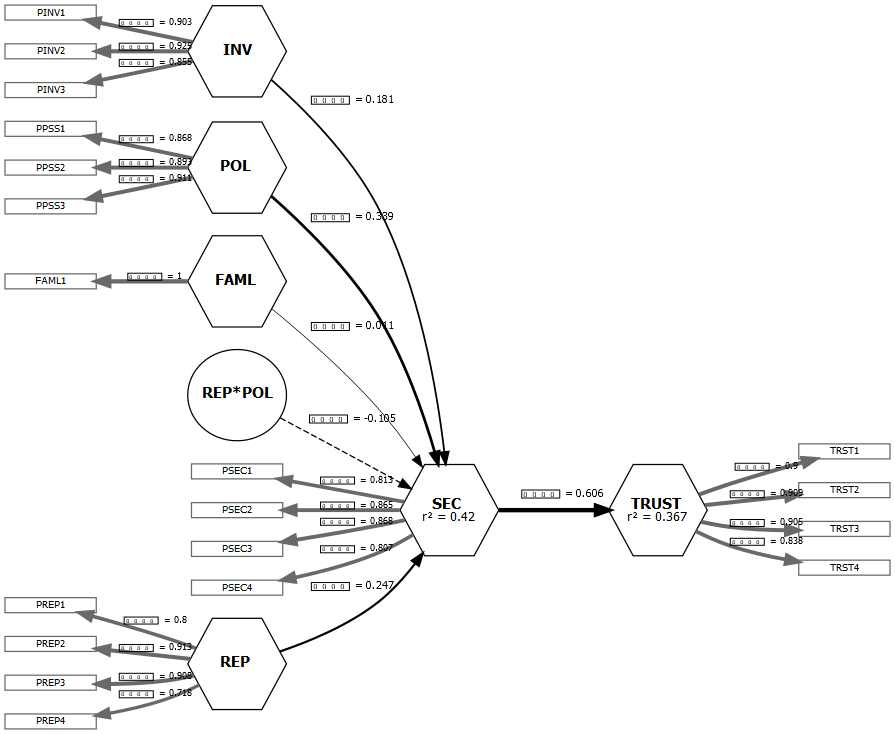

```{r setup, include=FALSE}
knitr::opts_chunk$set(echo = TRUE)
require(readxl)
require(seminr)

#install.packages("webshot")
#webshot::install_phantomjs()
```

Loading the security data:
```{r}
security_data <- read.csv("../../data/security_data_sem.csv")
```

# Question 1

## a) Creating a PLS path model using SEMinR

### i) Creating the Measurement Model

All the constructs shall be measured as composites. We include the constructs TRUST, SEC, REP, INV, POL, FAML and an orthogonalized interaction term between REP and POL:
```{r}
sec_intxn_mm <- constructs(
  composite("TRUST", multi_items("TRST", 1:4)),
  composite("SEC", multi_items("PSEC", 1:4)),
  composite("REP", multi_items("PREP", 1:4)),
  composite("INV", multi_items("PINV", 1:3)),
  composite("POL", multi_items("PPSS", 1:3)),
  composite("FAML", single_item("FAML1")),
  interaction_term(iv="REP", moderator="POL", method=orthogonal)
)
```

### ii) Creating the Structural Model

This is the path that we want to reproduce:
$$
REP +INV + POL + FAML + (REP \times POL) \to SEC \to TRUST
$$
And here's the code for setting it up:
```{r}
sec_intxn_sm <- relationships(
  paths(from = c("REP", "INV", "POL", "FAML", "REP*POL"), to = "SEC"),
  paths(from = "SEC", to = "TRUST")
)
```

Next, we run the Partial Least Squares regression to estimate the model:
```{r}
sec_intxn_pls <- estimate_pls(
  data = security_data,
  measurement_model = sec_intxn_mm, 
  structural_model = sec_intxn_sm
)
```

## b) Presenting results

### i) Figure of the estimated model

```{r, message=FALSE, warning=FALSE}
p1 <- plot(sec_intxn_pls)
save_plot(plot = p1, filename = "plot_1.png")
```

```{r plot_1, echo=FALSE, fig.cap="Composite Path Model using PLS-PM", out.width = '80%', out.height = '80%', fig.align='center'}

```

### ii) Weights and Loadings of composites

Here are the weights:
```{r}
sec_report <- summary(sec_intxn_pls)
pls_weights <- sec_report$weights
knitr::kable(round(pls_weights, 3), caption = "Weights of the composites")
```

And here are the loadings:
```{r}
pls_loadings <- sec_report$loadings
knitr::kable(round(pls_loadings, 3), caption = "Loadings of the composites")
```

### iii) Regression coefficients of paths between factors

```{r}
pls_paths <- sec_report$paths
knitr::kable(round(pls_paths, 3), 
             caption = "Regression coefficients of paths between factors")
```

### iv) Bootstrapped path coefficients: t-stats & 95% CIs

Let's put into practice the bootstrapping technique:
```{r, warning=FALSE, message=FALSE}
boot_intxn <- bootstrap_model(sec_intxn_pls, nboot = 1000)
boot_report <- summary(boot_intxn)
```

Here are the t-statistics and 95% CIs of the structural paths:
```{r}
info <- boot_report$bootstrapped_paths[, 4:6]
knitr::kable(round(info, 3), 
             caption = "t-statistics and 95% CIs of the bootstrapped path coefficients")
```

# Question 2

## a) Creating a common factor model using SEMinR

### i) Converting the composite Measurement Model into being entirely reflective

```{r}
sec_cf_mm <- as.reflective(sec_intxn_mm)
```

### ii) Using the same structural model as before

We run the PLS model using the new reflective measurement model and the old structural model:
```{r, warning=FALSE, message=FALSE}
sec_cf_sm <- sec_intxn_sm

sec_cf_pls <- estimate_cbsem(
  data = security_data,
  measurement_model = sec_cf_mm, 
  structural_model = sec_cf_sm
)
```
\newpage

## b) Showing results

### i) Figure of the estimated model

```{r plot_2, warning=FALSE, message=FALSE, echo=FALSE, fig.cap="Common Factor Model using CB-SEM", out.width = '100%', out.height = '100%', fig.align='center'}
plot(sec_cf_pls)
```

### ii) Loadings of composites

```{r}
cf_report <- summary(sec_cf_pls)
cf_loadings <- cf_report$loadings$coefficients
knitr::kable(round(cf_loadings, 3), 
             caption = "Loadings of the composites from the Common Factor Model")
```

### iii) Regression coefficients of paths between factors, and their p-values

Here are the regression coefficients between factors:
```{r}
cf_coef <- cf_report$paths$coefficients
knitr::kable(round(cf_coef, 3), caption = "Regression coefficients between factors")
```

And here are their p-values:
```{r}
cf_pvalues <- cf_report$paths$pvalues
knitr::kable(round(cf_pvalues, 3), 
             caption = "p-values of the regression coefficients of paths between factors")
```

